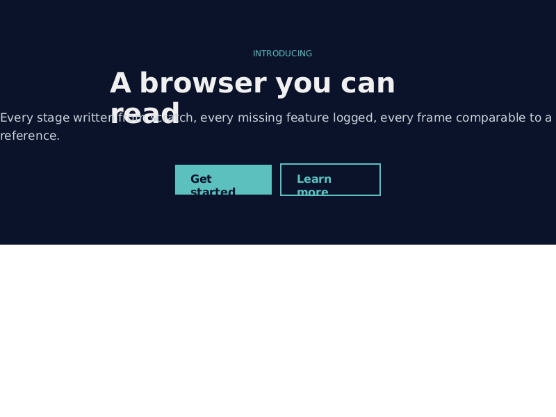
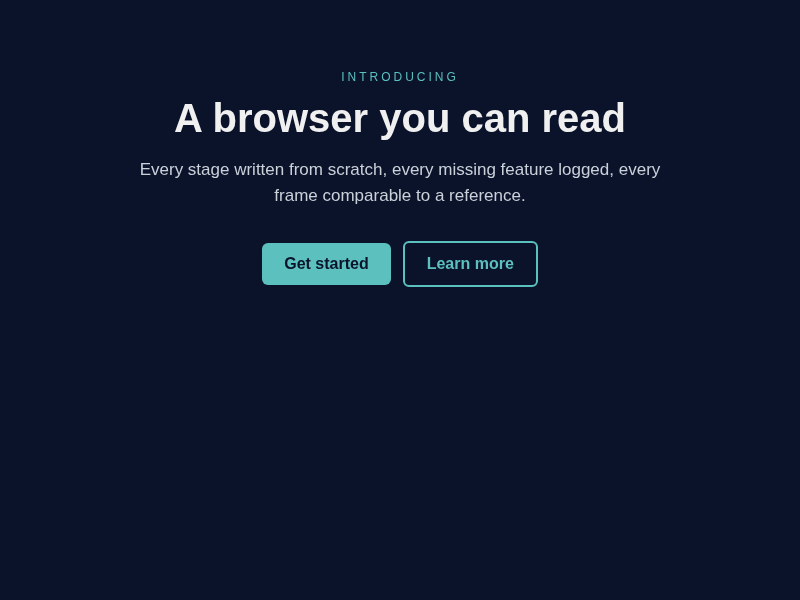
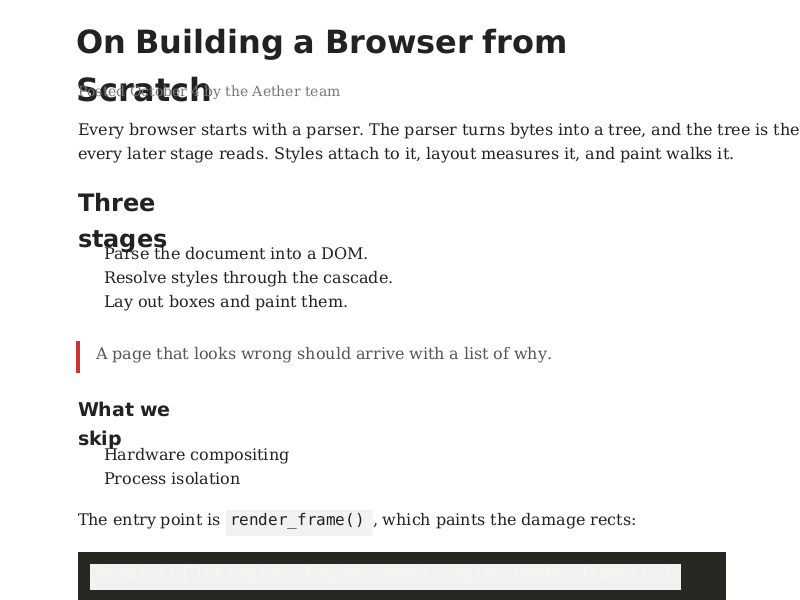
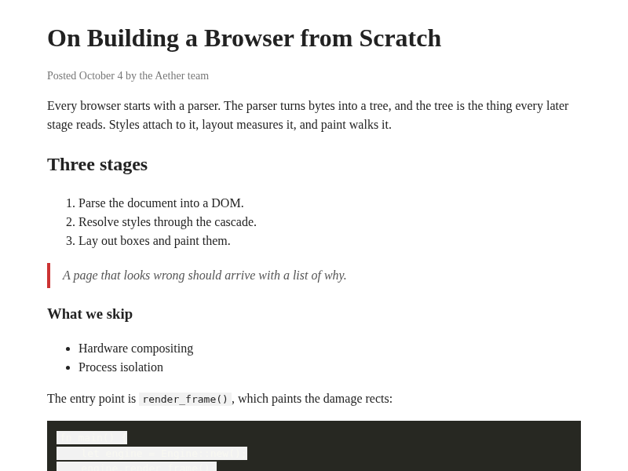
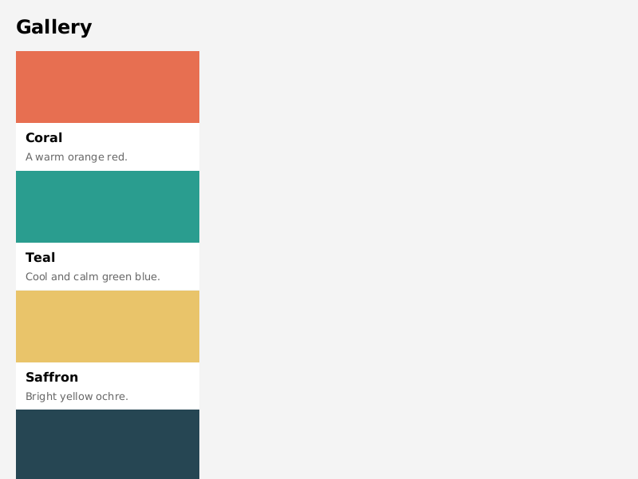
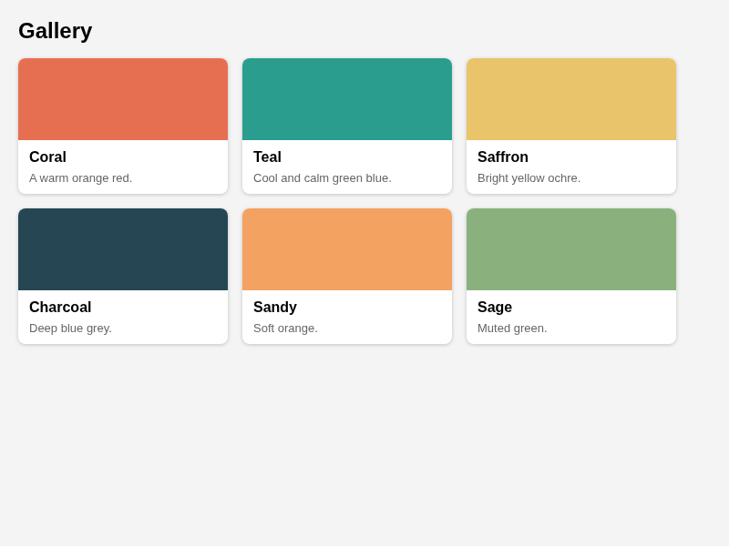

# EYES — an executor loop that can see what a program draws (was AETHERSEE)

Ledger row SR23. Branch `exec-aether-see`, cut from `8225dd86`. Peter (2026-10-04): "there's a megaton of
work behind a web browser and would be helpful if the executors are able to 'see' and test their results";
then: "ideally aethersee is not hard coded to aether so that anything we are able can be tested by you".

## The finding

Aether already had the eye (`aether render --html page --out page.png --ledger page.txt`, one frame to PNG
plus the missing-API ledger), but nothing to compare the frame against, so "does this page look right?" was a
judgement made by whoever happened to look. EYES supplies the reference, a number (SSIM + pixel mismatch per
case), a picture of the difference (`*.diff.png`, red where the frames disagree), and a gate — for any program
that can be made to produce pixels, not only Aether. The first look at Aether's numbers showed that the largest
misses are not exotic APIs from the ledger: they are core layout and paint behaviour that the ledger cannot
see, because the property is "handled" (`display:flex` parses) or there is no property at all (the canvas
background, which font the measurer used).

## The harness (`tools/eyes/`, Rust bin `eyes`, plus `ref.mjs`)

```
tools/eyes/run.sh aether          # build, render every subject + oracle, score, write SCORE.md, gate
tools/eyes/run.sh xvfb-smoke      # the generic proof: a vessel and Chromium under Xvfb, a PNG vs golden
```

Exit 0 green, 1 regressed past `baseline.json`, 2 harness error. Then read `tools/eyes/out/<suite>/SCORE.md`
and open the worst case's three PNGs (`out/<suite>/<case>.subject.png`, `.ref.png`, `.diff.png`) with the
Read tool. Flags: `--only SUBSTR` (one case; the gate then reports the rest MISSING, so gate a whole run),
`--all` (include optional/network cases, never gated), `--refresh-ref`, `--no-build`, `--accept` (rewrite the
suite's `baseline.json` after an intended improvement; thresholds survive: SSIM drop 0.02, mismatch rise 2.0).

A suite is `suites/<name>/suite.toml` (build steps, default size, default subject and oracle) plus
`suites/<name>/cases/*.toml`. Each case is four parts:

- **SUBJECT** yields the PNG under test: `cmd` (any command that writes `{out}` — Aether's headless render),
  `xvfb` (any GUI command on a private Xvfb screen, read from Xvfb's own `-fbdir` framebuffer after `wait_ms`;
  no X client tools needed; app and Xvfb killed by their own pids), `png` (an existing file — a kernel
  screenshot off the ESP, a QEMU screendump).
- **ORACLE** yields the reference: `chromium` (Playwright screenshot of `url`, device scale 1, no LCD text,
  cached by page mtime), `golden` (a checked-in PNG), `cmd` (another command that writes `{ref}`).
- **SCORER**: SSIM (mean over 8x8 windows, stride 4, of the 2x-downsampled greyscale frames — a layout and
  structure measure tolerant of sub-pixel anti-aliasing) and mismatch % (pixels whose largest channel differs
  by more than 40); `mask = [[x, y, w, h], ...]` blanks clocks and cursors in both frames. If the subject
  wrote an Aether-format ledger, its distinct count and top three go into SCORE.md.
- **GATE**: `scores.json` against `suites/<name>/baseline.json`.

Placeholders: `{repo} {suite} {outdir} {case} {out} {ref} {w} {h} {page} {url}`. Pointing EYES at a new
subject is one case file — the vessel case in `suites/xvfb-smoke/cases/smoke.toml`, verbatim:

```
[[case]]
name = "aether-shell"
subject = { kind = "xvfb", run = "{repo}/target/release/aether-shell", wait_ms = 5000 }
oracle = { kind = "golden", path = "golden/aether-shell.png" }
```

(First run: no golden yet, the case scores 0 with a note; copy `out/<suite>/<case>.subject.png` to the golden
path after looking at it, then `--accept`.)

Determinism: two consecutive runs, and a run with `--refresh-ref`, produced byte-identical `scores.json`; the
vessel's Xvfb grab scored SSIM 1.000 / 0.0% against a capture from the previous run.

## Suite one: Aether (`tools/eyes/suites/aether/`, 16 pages, 18 cases)

Every page is self-contained (inline CSS, images as `data:` URIs) and its first line is a comment saying what it
tests. A page whose header mentions 375 is rendered at 800x600 and at 375x812.

| page | tests |
|---|---|
| 01-blog-article | headings, paragraphs, ol/ul, blockquote, inline code, pre block, serif body |
| 02-flex-two-column | fixed sidebar + fluid main via `flex: 0 0 200px` / `flex: 1`, gap, header/footer |
| 03-card-gallery | flex-wrap card gallery (grid is not claimed by Aether), gap, radius, shadow |
| 04-sticky-nav | `position: sticky` nav of inline-block links under a gradient hero |
| 05-form | text/email/password inputs, select, checkbox, radio, textarea, buttons |
| 06-table-zebra | border-collapse, cell borders, th, `:nth-child(even)` zebra rows, caption |
| 07-images-svg | PNG scaled by width/height attributes, SVG data URI, inline `<svg>`, figcaption |
| 08-inline-wrap | nested b/i/u/s/mark/sup/sub/small/a; overflow-wrap and word-break on long words |
| 09-media-queries (+@375) | `@media (max-width: 600px)` switches direction, colour, display:none |
| 10-calc-clamp (+@375) | calc/clamp/min/max with %, vw, rem for widths, padding, font-size |
| 11-non-latin | Japanese, Chinese, Cyrillic, Greek, Hebrew fallback in a sans-serif page |
| 12-js-mutation | createElement/appendChild, textContent, classList, style, innerHTML on load |
| 13-ua-defaults | no author CSS at all: h1-h6, hr, dl, nested lists, pre, link colour |
| 14-boxes | border styles/radius, per-side borders, margin collapsing, inline-block chips |
| 15-landing | centred max-width hero, uppercase + letter-spacing, inline-block CTA buttons |
| 16-positioned | relative/absolute badge, z-index stacking, position: fixed bar |

Live (optional, `cases/live.toml`, run only with `--all`): example.com, en.wikipedia.org/wiki/Web_browser, text.npr.org. All three
were refused by this sandbox's egress policy (`connect_rejected`) on 2026-10-04, so they are scored as
"no reference frame" and never enter the baseline.

Before any fix: mean SSIM **0.741**, mean mismatch **14.2%** ([SCORE-before.md](SCORE-before.md)).
After M3: mean SSIM **0.797**, mean mismatch **8.9%** ([SCORE-after.md](SCORE-after.md)).

## M2 — looking at the three worst

**15-landing (SSIM 0.510, mismatch 45.3%).**  vs 
- Missing default/propagation: the dark `body` background paints only the body's own box; everything below the
  content is white, where every browser paints the root/body background over the whole canvas. This alone is
  most of the 45% mismatch.
- Font metrics: the h1 wraps "read" onto a second line and the line overlaps the paragraph — the box was
  measured with the regular face, painted with the bold face, so painted text is wider than its box.
- Missing property: `letter-spacing` (ledgered), `border-radius` (parsed, not painted); the CTA anchors'
  inline-block shrink-to-fit width wraps "Get started" and clips the second line.
- Layout: the paragraph ignores the hero's `max-width` and spans the viewport.

**14-boxes (SSIM 0.525, mismatch 15.6%).**
- Missing default/propagation: same canvas background miss (`#fafafa` body, white canvas below it).
- Layout: no margin collapsing — adjacent 16px margins give a 32px gap, so every box drifts further down.
- Missing paint: dashed/dotted styles paint solid, `border-radius` not painted; boxes are 16px too wide on the
  right (body padding-right lost).

**01-blog-article (SSIM 0.613, mismatch 13.4%).**  vs 
- Font metrics: every heading overlaps the next block. Headings are bold; the measurer always used the family's
  *regular* face, the painter the *bold* face (and, for serif, a sans-bold face), so "Three stages" is measured
  narrow, wrapped by the painter at a width it was never given, and the second line lands on the list.
- Family: headings in a `font-family: serif` page paint in sans-serif bold (the painter only ever had a sans
  bold face); italics never paint italic.
- Missing default style: list markers (1. 2. 3., bullets) are not painted; `pre` collapses its newlines.

**Also read:** 03-card-gallery (SSIM 0.741, mismatch 32.1%) —  vs
. The six cards stack in one column. `display:flex` maps to a taffy flex box but
keeps Aether's internal *column* direction (its block approximation), and `flex`, `flex-wrap`, `gap`,
`flex-grow/shrink/basis` are not implemented at all (`property:flex`, `property:gap`, `property:flex-wrap` in
the ledger). Same miss on 02 (sidebar not beside main) and 09 (three columns stacked at 800px).

### The three largest fixable misses (picked)

1. **Flexbox is not flexbox** — `display:flex` must be a row container and the flex properties must reach taffy
   (02, 03, 09; the most common modern layout primitive).
2. **Canvas background** — the root/body background must cover the whole viewport (14, 15, and any page with a
   coloured body).
3. **Measure and paint disagree on the font** — one face resolver (family + weight + style) shared by the text
   measurer and the painter (01, 15 and every page with bold/serif/italic text).

Margin collapsing, list markers, `pre` whitespace, border styles/radius and letter-spacing are real but each is
smaller or larger-scoped; they are recorded under "What stays owed".

## M3 — the three fixes (one commit each, a test each)

| fix | commit | what changed | moved (SSIM / mismatch) |
|---|---|---|---|
| 1 flexbox | `fc9a4610` | `display:flex` gets CSS initial values (row, nowrap, stretch), not Aether's internal column; `flex`, `flex-grow/shrink/basis`, `flex-wrap`, `flex-flow`, `gap`/`row-gap`/`column-gap` reach taffy; flex items size by content; min-content text is the widest word; a lone text run wraps at its box width | 03 0.741/32.1% -> 0.915/1.6%; 09 0.836/20.8% -> 0.958/1.6%; 02 0.709 -> 0.752 |
| 2 canvas | `5e333cd7` | the root/body background propagates to and fills the whole canvas | 15 0.521/45.2% -> 0.879/3.8% |
| 3 one face | `28a5d93c` | one face resolver (family + weight + style) shared by measurer and painter; serif bold and italics paint in their own faces | 01 0.607/14.1% -> 0.653/12.0%; 04 0.685 -> 0.722; 03 -> 0.966/0.9% |

Mean SSIM 0.741 -> 0.797, mismatch 14.2% -> 8.9%. Before ([fix1-flex-before.png](fix1-flex-before.png),
[fix2-canvas-before.png](fix2-canvas-before.png), [fix3-font-before.png](fix3-font-before.png)), after
(`*-after.png`) and Chromium (`*-ref.png`) frames are beside this file. The one drop: 05-form 0.724 -> 0.703
(control labels now measured in the face they paint with, and Aether's controls are not Chromium's).

## M4 — dependencies to latest stable (R83), `78bb61e5`

Every `handlers/aether` dependency resolves to its crates.io max stable (checked 2026-10-04): boa 0.21 -> 0.22,
taffy 0.12 -> 0.14, cssparser 0.37 -> 0.38, selectors 0.39 -> 0.41, html5ever 0.39 -> 0.40, reqwest 0.12 -> 0.13,
base64 0.22 -> 0.23, resvg 0.47 -> 0.48. API moves absorbed (fallible `JsArray::new`; taffy's min/max size as
length-percentage-auto and the `LayoutInput` measure closure; cssparser without `ParserInput`). boa 0.22 no longer
panics when a `RuntimeLimit` reaches a promise reaction (`into_opaque` is fallible), so the panic-guard test
accepts either outcome and still proves the process and DOM survive. All 18 EYES scores identical across the
bump; `cargo test -p aether` 89 passed.

## M5 — a real vessel under Xvfb, `55290069`

`suites/xvfb-smoke` case `aether-shell`: the vessel (quartzite tetra -> GTK 4) under a private Xvfb, against its
accepted golden. The host needed `libgtk-4-dev libgtksourceview-5-dev libspelling-1-dev libadwaita-1-dev`
(apt; Ubuntu 24.04 ships GTK 4.14). Both suites have baselines; both gates green; the gate was proven red
(exit 1) with a baseline raised past the run.

## Chicken wire (R83) — crates doing the work of a capability Aether claims

| capability | crate today (version) | status | built-in owner |
|---|---|---|---|
| JavaScript | `boa_engine`, `boa_gc` 0.22 | chicken wire | owed: an UnaOS JS engine |
| HTML parse + DOM tree | `kuchiki` 0.8.1 (unmaintained since 2020) over `html5ever` **0.25**, `cssparser` 0.27, `selectors` 0.22 | chicken wire, and stale: kuchiki pins the 2020 parser, so the tree carries two html5ever, cssparser and selectors generations | owed: Aether's own DOM + HTML tokenizer (from the WHATWG spec) |
| CSS tokenize + selectors | `cssparser` 0.38, `selectors` 0.41 | chicken wire | same arc as the DOM |
| Layout (block, flex) | `taffy` 0.14 | chicken wire (R83 names layout) | owed: Aether layout |
| Fonts: match + raster | `font-kit` 0.14, `pathfinder_geometry` 0.5 | chicken wire | owed (a `libs/` glyph core) |
| Raster image decode | `image` 0.25 | chicken wire | PIXELCORE (SR25) |
| SVG | `resvg` 0.48 | chicken wire | PIXELCORE (SR25) or its own lib |
| HTTP + TLS | `reqwest` 0.13 (rustls) | chicken wire | TLSCORE (SR28) |
| WebSocket | `tokio-tungstenite` 0.30 | declared, unused (`api/websockets.rs` is a stub) | with TLSCORE |
| URL (WHATWG) | `url` 2.5 | chicken wire | owed |
| base64 (`data:` URIs) | `base64` 0.23 | trivially built-in | owed (a few lines) |
| The harness itself | `image` (PNG I/O), `toml`, `serde` in `tools/eyes` | tooling, no claimed capability; SSIM, diff, XWD decode are written here | — |
| The oracle | Chromium (Playwright, `/opt/pw-browsers`) | a reference by design, not part of the product | — |

## What stays owed

- Aether misses seen and not fixed: margin collapsing (14), list markers and `pre` whitespace (01, 13),
  dashed/dotted borders and `border-radius` paint (14, 15), `letter-spacing`, `linear-gradient` backgrounds (04),
  `clamp()` font sizes (10), `z-index` (16), `overflow-wrap`/`word-break` (08), `border-collapse` (06),
  `box-shadow` (03), form-control look (05). Current worst three: 14-boxes 0.545, 01-blog-article 0.653,
  05-form 0.703.
- The chicken-wire rows above; first in line is the kuchiki DOM (unmaintained, drags three 2020 crates).
- Live URLs are refused by this sandbox's egress (`connect_rejected`); `--all` scores them where egress allows.
- More suites: the kernel's framebuffer (a `png` subject off a QEMU screendump vs golden), Lumen and una under
  Xvfb; the aether-shell golden is its blank start page — a case that navigates it to a corpus page and scores
  the viewport against Chromium (mask the chrome) needs a start-URL argument on the vessel.
- A DEPS audit across the whole workspace (R83) — this arc bumped only `handlers/aether`.
